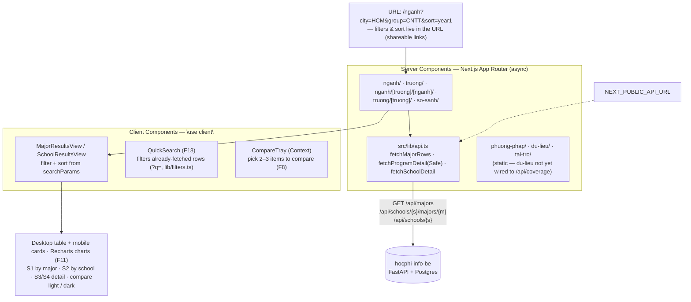

<p align="right">
  <a href="README-en.md"> English</a>
  &nbsp;|&nbsp;
  <a href="README.md"> Tiếng Việt</a>
</p>

# hocphi-info-fe 🎓

**Web UI for looking up and comparing Vietnamese university tuition — by major and by school.**

See the tuition of a single major–school pair normalized to `VND/year`, split by program track
(standard / high-quality / advanced / international), and get an **estimate of the full-course
cost** (4–6 years) based on the annual tuition-increase rate. No login required.

> ⚠️ **Note**: wired to the real [`hocphi-info-be`](../hocphi-info-be); tuition data so far
> covers **part of the 50 pilot schools** (the crawler is still running) — many
> schools/majors won't have numbers yet. This is also a **React/Next.js learning project**:
> the owner comes from Flutter and is learning while building. All screens are done (S1–S4,
> compare, secondary pages) — **ready to deploy**.

- [hocphi-info-fe 🎓](#hocphi-info-fe-)
  - [I. How it works](#i-how-it-works)
  - [II. Tech stack](#ii-tech-stack)
  - [III. Project layout](#iii-project-layout)
  - [IV. Getting started](#iv-getting-started)
  - [V. Roadmap](#v-roadmap)

## I. How it works



The home page leads to the lookup screens:

- **`/nganh` (S1)** — programs listed by major: first-year tuition, increase rate, track,
  school type; filter by city / major group / track, sort by column, all reflected in the URL.
- **`/truong` (S2)** — grouped by school: Min–Max range, median tuition for the standard track,
  number of majors (recomputed on the client from the `/nganh` data, no separate endpoint).
- **`/nganh/[truong]/[nganh]` (S3, F6)** · **`/truong/[truong]` (S4, F7)** — detail pages:
  all tracks together, a tuition-trend chart, a full-course cost estimate (F9), sources (F12).
- **`/so-sanh` (F8)** — pick 2–3 items from a table; the compare list is URL-encoded (shareable).
- **`/phuong-phap` (F14)** · **`/du-lieu` (F15)** · **`/tai-tro`** — secondary pages, static content.

`src/lib/api.ts` calls [`hocphi-info-be`](../hocphi-info-be) (FastAPI) directly via
`NEXT_PUBLIC_API_URL` — no mock Route Handler layer in between. QuickSearch (F13) does **not**
hit a separate endpoint: it filters the already-fetched list (`?q=` parsed in `lib/filters.ts`).

## II. Tech stack

Next.js 16 (App Router) · React 19 · TypeScript · Tailwind CSS 4 (`@theme inline`) ·
ESLint + Prettier + Husky · Recharts

"Xanh Tri Thức" color palette (oklch tokens in `src/app/globals.css`), light/dark support.
SEO: `robots.ts` · `sitemap.ts` · JSON-LD (`components/JsonLd.tsx`) · `not-found.tsx`.

## III. Project layout

```
src/
  app/
    page.tsx  layout.tsx  globals.css  not-found.tsx  robots.ts  sitemap.ts  icon.svg
    nganh/                         # "/nganh" (S1) — page + loading + error
    nganh/[truong]/[nganh]/        # "/nganh/uit/cong-nghe-thong-tin" (S3, F6)
    truong/                        # "/truong" (S2)
    truong/[truong]/               # "/truong/uit" (S4, F7)
    so-sanh/                       # "/so-sanh" (F8) — compare list URL-encoded
    phuong-phap/  du-lieu/  tai-tro/   # static secondary pages (F14 / F15 / sponsor)
  components/           # FilterPanel, SortableHeader, QuickSearch, CompareTray/View/Table,
                        # *ResultsTable/View, *RangeChart, TuitionTrendChart, CompareTrendChart,
                        # DistributionStrip, JsonLd, SchoolLogo, SiteHeader/SiteNav/SiteFooter…
  hooks/                # useCompareSelection.ts
  lib/                  # api.ts (calls the real hocphi-info-be), api-base.ts, filters.ts,
                        # url.ts, derive.ts, format.ts, compare.ts, site.ts, text.ts
  types/domain.ts       # shared types, aligned with the backend schema
docs/                   # (git-ignored) LEARNING_PATH.md + brainstorms/ + plans/
```

Route-specific components that aren't reused live next to their `page.tsx` (colocation)
rather than being forced into `components/`.

## IV. Getting started

Start [`hocphi-info-be`](../hocphi-info-be) first (see that repo's README — Docker Compose for
Postgres + `uvicorn` for the API on `:8000`), then:

```bash
cp .env.example .env.local     # NEXT_PUBLIC_API_URL=http://127.0.0.1:8000
npm install
npm run dev                    # http://localhost:3000
```

Open `/nganh` or `/truong` to see the lookup screens (real data, part of the 50 schools have numbers).

Checks:

```bash
npm run lint
npm run format
npm run build
```

> Server-side Node fetch resolves `localhost` to IPv6 `::1`, causing `ECONNREFUSED`;
> `src/lib/api-base.ts` rewrites `//localhost:` → `//127.0.0.1:`. If you set
> `NEXT_PUBLIC_API_URL`, use `127.0.0.1` instead of `localhost`.

## V. Roadmap

Built along [`docs/LEARNING_PATH.md`](docs/LEARNING_PATH.md), one concept cluster per week:

- [x] **Week 1** — static routes + components, fake data (`/nganh`, `/truong`)
- [x] **Week 2** — Route Handlers + `fetch`/async, Server vs Client Components, `loading`/`error`
- [x] **Week 3** — filters & sort + URL state (`searchParams`), client-side quick search (F13), table polish
- [x] **Week 4** — major–school and school detail pages (S3/S4), dynamic routes
      (`/nganh/[truong]/[nganh]`, `/truong/[truong]`), Recharts charts (F11), source transparency (F12)
- [x] **Week 5+** — compare 2–3 items (F8, `/so-sanh`, URL-encoded list), full-course cost
      estimate (F9), secondary pages: `/phuong-phap` (F14), `/du-lieu` (F15), `/tai-tro`
- [x] SEO & page shell — `robots.ts`, `sitemap.ts`, JSON-LD, `not-found`
- [x] Wired to the real [`hocphi-info-be`](../hocphi-info-be) — all screens (S1/S2/S3/S4, compare)
- [ ] Deploy · user testing — _screens are done, ready to deploy_

Product context: [`../y-tuong-hoc-phi-dai-hoc.md`](../y-tuong-hoc-phi-dai-hoc.md) ·
feature spec: `../yeu-cau-san-pham.md`.
