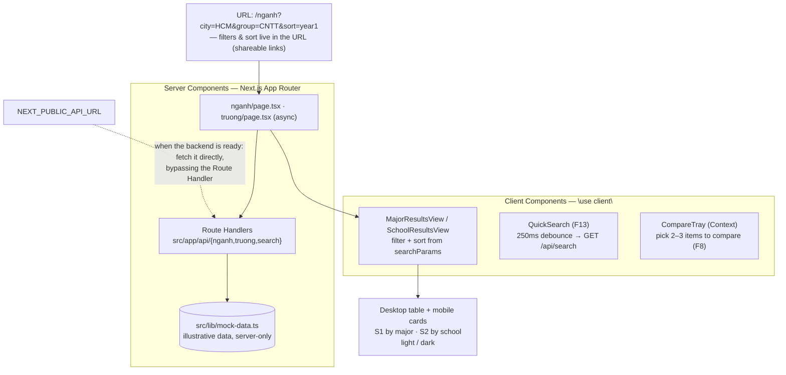

<p align="right">
  <a href="README-en.md"> English</a>
  &nbsp;|&nbsp;
  <a href="README.md"> Tiếng Việt</a>
</p>

# hocphi-info-fe 🎓

**Web UI for looking up and comparing Vietnamese university tuition — by major and by school.**

See the tuition of a single major–school pair normalized to `VND/year`, split by program track
(standard / high-quality / advanced / international), and get an **estimate of the full-course
cost** (4–6 years) based on the annual tuition-increase rate. No login required.

> ⚠️ **Note**: the numbers currently run on **illustrative mock data**
> (`src/lib/mock-data.ts`), not real tuition — the backend
> ([`hocphi-info-be`](../hocphi-info-be)) isn't wired up yet. This is also a
> **React/Next.js learning project**: the owner comes from Flutter and is learning while
> building.

- [hocphi-info-fe 🎓](#hocphi-info-fe-)
  - [I. How it works](#i-how-it-works)
  - [II. Why it's built this way](#ii-why-its-built-this-way)
  - [III. Tech stack](#iii-tech-stack)
  - [IV. Project layout](#iv-project-layout)
  - [V. Getting started](#v-getting-started)
  - [VI. Roadmap](#vi-roadmap)

## I. How it works



The home page leads to two lookup screens:

- **`/nganh` (S1)** — programs listed by major: first-year tuition, increase rate, track,
  school type; filter by city / major group / track, sort by column, all reflected in the URL.
- **`/truong` (S2)** — grouped by school: Min–Max range, median tuition for the standard track,
  number of majors.

Data flows through **Route Handlers** (`src/app/api/*`) that stand in for the real backend.
Once [`hocphi-info-be`](../hocphi-info-be) is live, just set `NEXT_PUBLIC_API_URL` and
`src/lib/api.ts` calls that API directly — components don't change.

## II. Why it's built this way

**1. This is a React/Next.js learning project, not just feature delivery.** The owner has 4
years of Flutter and is new to React/Next/TS. The build follows
[`docs/LEARNING_PATH.md`](docs/LEARNING_PATH.md) — each "week" learns one cluster of concepts
when it's actually needed, with a "what we learned" section and a diagram for reading the code.

**2. No named architecture (no MVC/Clean Architecture).** Next.js's file-system router _is_
the routing layer; the rest is a flat, colocated structure. The app is read / filter / display,
not complex business logic — no repository/use-case/entity layers.

**3. Mirrors the backend schema from day one.** `src/types/domain.ts` mirrors
[`hocphi-info-be/docs/schema.md`](../hocphi-info-be/docs/schema.md) (camelCase, enums as string
unions). So "connect the real API" is just swapping the data _source_, not touching the UI.

**4. Filters & sort live in the URL.** Using `searchParams` instead of local state makes every
filtered result shareable via link and survive a page reload.

**5. Minimal tooling.** Only `useState`/`useReducer`/Context and plain `fetch` — no
Redux/Zustand/React Query until there's a real need.

## III. Tech stack

Next.js 16 (App Router) · React 19 · TypeScript · Tailwind CSS 4 (`@theme inline`) ·
ESLint + Prettier + Husky · Recharts (from Week 4)

"Xanh Tri Thức" color palette (oklch tokens in `src/app/globals.css`), light/dark support.

## IV. Project layout

```
src/
  app/
    page.tsx            # "/" — home
    layout.tsx          # shared shell: SiteHeader + SiteFooter
    globals.css         # Tailwind 4 tokens + color palette
    nganh/              # "/nganh" (S1) — page + loading.tsx + error.tsx
    truong/             # "/truong" (S2) — page + loading.tsx + error.tsx
    api/                # Route Handlers: nganh · truong · search (stand-in backend)
  components/           # reusable UI: FilterPanel, SortableHeader, QuickSearch,
                        # CompareTray, *ResultsTable/View, *Badge, charts…
  lib/                  # api.ts, api-base.ts, filters.ts, url.ts, derive.ts,
                        # format.ts, mock-data.ts (server-only)
  types/domain.ts       # shared types, aligned with the backend schema
docs/                   # (git-ignored) LEARNING_PATH.md + brainstorms/ + plans/
```

Route-specific components that aren't reused live next to their `page.tsx` (colocation)
rather than being forced into `components/`.

## V. Getting started

```bash
cp .env.example .env.local     # leave NEXT_PUBLIC_API_URL empty -> use the internal Route Handler
npm install
npm run dev                    # http://localhost:3000
```

Open `/nganh` or `/truong` to see the two lookup screens (running on mock data).

Checks:

```bash
npm run lint
npm run format
npm run build
```

> Server-side Node fetch resolves `localhost` to IPv6 `::1`, causing `ECONNREFUSED`;
> `src/lib/api-base.ts` rewrites `//localhost:` → `//127.0.0.1:`. If you set
> `NEXT_PUBLIC_API_URL`, use `127.0.0.1` instead of `localhost`.

## VI. Roadmap

Built along [`docs/LEARNING_PATH.md`](docs/LEARNING_PATH.md), one concept cluster per week:

- [x] **Week 1** — static routes + components, fake data (`/nganh`, `/truong`)
- [x] **Week 2** — Route Handlers + `fetch`/async, Server vs Client Components, `loading`/`error`
- [x] **Week 3** — filters & sort + URL state (`searchParams`), quick search (F13), table polish
- [ ] **Week 4** — major–school detail pages (S3/S4), dynamic routes, Recharts charts (F11)
- [ ] **Week 5+** — compare 2–3 items (F8), full-cost estimate (F9), secondary pages
      (F14 methodology, F15 data & sources, F17 issue reports)
- [ ] Wire up the real [`hocphi-info-be`](../hocphi-info-be) · deploy · user testing

Product context: [`../y-tuong-hoc-phi-dai-hoc.md`](../y-tuong-hoc-phi-dai-hoc.md) ·
feature spec: `../yeu-cau-san-pham.md`.
