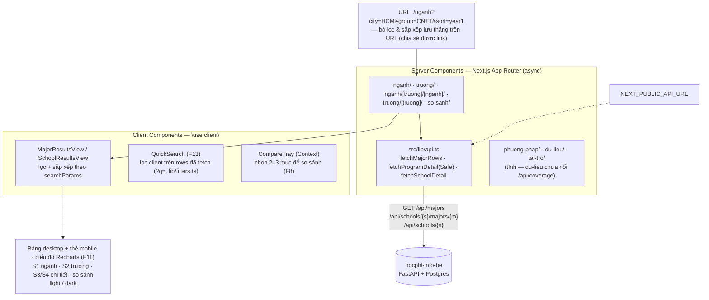

<p align="right">
  <a href="README-en.md"> English</a>
  &nbsp;|&nbsp;
  <a href="README.md"> Tiếng Việt</a>
</p>

# hocphi-info-fe 🎓

**Giao diện web tra cứu & so sánh học phí đại học Việt Nam — theo từng ngành, từng trường.**

Xem học phí một ngành–trường quy về `đồng/năm`, tách theo hệ đào tạo (đại trà / chất lượng
cao / tiên tiến / quốc tế), và ước lượng **tổng chi phí cả khoá** (4–6 năm) dựa trên % tăng
học phí hàng năm. Không cần đăng nhập.

> ⚠️ **Lưu ý**: đã nối [`hocphi-info-be`](../hocphi-info-be) thật; dữ liệu học phí mới phủ
> **một phần trong 50 trường pilot** (crawler đang chạy tiếp) — nhiều trường/ngành sẽ chưa
> có số. Đây cũng là một **dự án học React/Next.js**: chủ dự án nền Flutter, vừa build sản
> phẩm vừa học. Các màn hình đã xong (S1–S4, so sánh, các trang phụ) — **sẵn sàng deploy**.

- [hocphi-info-fe 🎓](#hocphi-info-fe-)
  - [I. Cách hoạt động](#i-cách-hoạt-động)
  - [II. Công nghệ](#ii-công-nghệ)
  - [III. Cấu trúc dự án](#iii-cấu-trúc-dự-án)
  - [IV. Chạy thử](#iv-chạy-thử)
  - [V. Lộ trình](#v-lộ-trình)

## I. Cách hoạt động



Trang chủ dẫn tới các màn hình tra cứu:

- **`/nganh` (S1)** — danh sách chương trình theo ngành: học phí năm đầu, % tăng, hệ đào tạo,
  loại trường; lọc theo thành phố / nhóm ngành / hệ, sắp xếp theo cột, tất cả phản ánh trên URL.
- **`/truong` (S2)** — gom theo trường: khoảng Min–Max, trung vị học phí hệ đại trà, số ngành
  (tính lại từ dữ liệu `/nganh` ngay trên client, không gọi endpoint riêng).
- **`/nganh/[truong]/[nganh]` (S3, F6)** · **`/truong/[truong]` (S4, F7)** — trang chi tiết:
  gộp mọi hệ đào tạo, biểu đồ xu hướng học phí, ước lượng tổng chi phí cả khoá (F9), nguồn (F12).
- **`/so-sanh` (F8)** — chọn 2–3 mục ở bảng; danh sách so sánh mã hoá trên URL (chia sẻ được).
- **`/phuong-phap` (F14)** · **`/du-lieu` (F15)** · **`/tai-tro`** — trang phụ, nội dung tĩnh.

`src/lib/api.ts` gọi thẳng [`hocphi-info-be`](../hocphi-info-be) (FastAPI) qua
`NEXT_PUBLIC_API_URL` — không còn lớp Route Handler mock đứng giữa. QuickSearch (F13) **không**
gọi API riêng: nó lọc ngay trên danh sách đã fetch (`?q=` parse ở `lib/filters.ts`).

## II. Công nghệ

Next.js 16 (App Router) · React 19 · TypeScript · Tailwind CSS 4 (`@theme inline`) ·
ESLint + Prettier + Husky · Recharts

Bảng màu "Xanh Tri Thức" (token oklch trong `src/app/globals.css`), hỗ trợ light/dark.
SEO: `robots.ts` · `sitemap.ts` · JSON-LD (`components/JsonLd.tsx`) · `not-found.tsx`.

## III. Cấu trúc dự án

```
src/
  app/
    page.tsx  layout.tsx  globals.css  not-found.tsx  robots.ts  sitemap.ts  icon.svg
    nganh/                         # "/nganh" (S1) — page + loading + error
    nganh/[truong]/[nganh]/        # "/nganh/uit/cong-nghe-thong-tin" (S3, F6)
    truong/                        # "/truong" (S2)
    truong/[truong]/               # "/truong/uit" (S4, F7)
    so-sanh/                       # "/so-sanh" (F8) — danh sách mã hoá trên URL
    phuong-phap/  du-lieu/  tai-tro/   # trang phụ tĩnh (F14 / F15 / tài trợ)
  components/           # FilterPanel, SortableHeader, QuickSearch, CompareTray/View/Table,
                        # *ResultsTable/View, *RangeChart, TuitionTrendChart, CompareTrendChart,
                        # DistributionStrip, JsonLd, SchoolLogo, SiteHeader/SiteNav/SiteFooter…
  hooks/                # useCompareSelection.ts
  lib/                  # api.ts (gọi hocphi-info-be thật), api-base.ts, filters.ts, url.ts,
                        # derive.ts, format.ts, compare.ts, site.ts, text.ts
  types/domain.ts       # kiểu dùng chung, khớp schema backend
docs/                   # (git-ignore) LEARNING_PATH.md + brainstorms/ + plans/
```

Component đặc thù một route mà không dùng lại thì để cạnh `page.tsx` (colocation), không ép
đưa vào `components/`.

## IV. Chạy thử

Chạy [`hocphi-info-be`](../hocphi-info-be) trước (xem README repo đó — Docker Compose cho
Postgres + `uvicorn` cho API ở `:8000`), rồi:

```bash
cp .env.example .env.local     # NEXT_PUBLIC_API_URL=http://127.0.0.1:8000
npm install
npm run dev                    # http://localhost:3000
```

Mở `/nganh` hoặc `/truong` để xem các màn hình tra cứu (dữ liệu thật, một phần 50 trường có số).

Kiểm thử:

```bash
npm run lint
npm run format
npm run build
```

> Node fetch phía server resolve `localhost` ra IPv6 `::1` gây `ECONNREFUSED`; `src/lib/api-base.ts`
> tự ép `//localhost:` → `//127.0.0.1:`. Nếu đặt `NEXT_PUBLIC_API_URL`, dùng `127.0.0.1` thay `localhost`.

## V. Lộ trình

Xây theo [`docs/LEARNING_PATH.md`](docs/LEARNING_PATH.md), mỗi tuần một nhóm khái niệm:

- [x] **Tuần 1** — route tĩnh + component, dữ liệu giả (`/nganh`, `/truong`)
- [x] **Tuần 2** — Route Handlers + `fetch`/async, Server vs Client Components, `loading`/`error`
- [x] **Tuần 3** — bộ lọc & sắp xếp + URL state (`searchParams`), tìm nhanh client (F13), tinh chỉnh bảng
- [x] **Tuần 4** — trang chi tiết ngành–trường & trường (S3/S4), dynamic routes
      (`/nganh/[truong]/[nganh]`, `/truong/[truong]`), biểu đồ Recharts (F11), minh bạch nguồn (F12)
- [x] **Tuần 5+** — so sánh 2–3 mục (F8, `/so-sanh`, danh sách mã hoá trên URL), ước lượng
      tổng chi phí cả khoá (F9), trang phụ: `/phuong-phap` (F14), `/du-lieu` (F15), `/tai-tro`
- [x] SEO & khung trang — `robots.ts`, `sitemap.ts`, JSON-LD, `not-found`
- [x] Nối [`hocphi-info-be`](../hocphi-info-be) thật — toàn bộ màn hình (S1/S2/S3/S4, so sánh)
- [ ] Deploy · người dùng thử — _các màn hình đã xong, sẵn sàng deploy_

Bối cảnh sản phẩm: [`../y-tuong-hoc-phi-dai-hoc.md`](../y-tuong-hoc-phi-dai-hoc.md) ·
đặc tả tính năng: `../yeu-cau-san-pham.md`.
