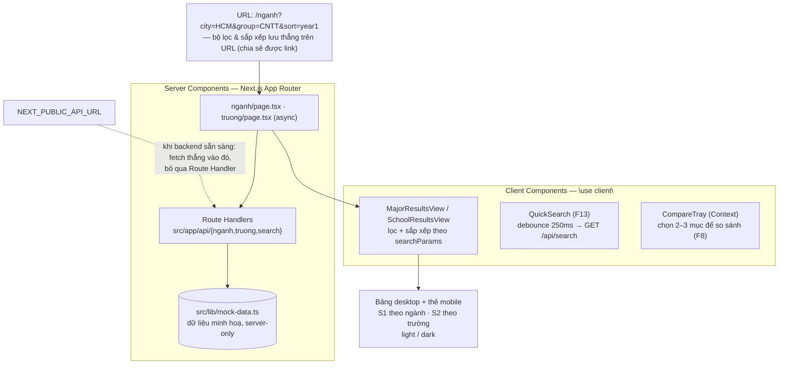

<p align="right">
  <a href="README-en.md"> English</a>
  &nbsp;|&nbsp;
  <a href="README.md"> Tiếng Việt</a>
</p>

# hocphi-info-fe 🎓

**Giao diện web tra cứu & so sánh học phí đại học Việt Nam — theo từng ngành, từng trường.**

Xem học phí một ngành–trường quy về `đồng/năm`, tách theo hệ đào tạo (đại trà / chất lượng
cao / tiên tiến / quốc tế), và ước lượng **tổng chi phí cả khoá** (4–6 năm) dựa trên % tăng
học phí hàng năm. Không cần đăng nhập.

> ⚠️ **Lưu ý**: các con số hiện đang chạy trên **dữ liệu minh hoạ** (`src/lib/mock-data.ts`),
> chưa phải học phí thật — backend ([`hocphi-info-be`](../hocphi-info-be)) chưa nối. Đây cũng
> là một **dự án học React/Next.js**: chủ dự án nền Flutter, vừa build sản phẩm vừa học.

- [hocphi-info-fe 🎓](#hocphi-info-fe-)
  - [I. Cách hoạt động](#i-cách-hoạt-động)
  - [II. Công nghệ](#iii-công-nghệ)
  - [III. Cấu trúc dự án](#iv-cấu-trúc-dự-án)
  - [IV. Chạy thử](#v-chạy-thử)
  - [V. Lộ trình](#vi-lộ-trình)

## I. Cách hoạt động



Trang chủ dẫn tới hai màn hình tra cứu:

- **`/nganh` (S1)** — danh sách chương trình theo ngành: học phí năm đầu, % tăng, hệ đào tạo,
  loại trường; lọc theo thành phố / nhóm ngành / hệ, sắp xếp theo cột, tất cả phản ánh trên URL.
- **`/truong` (S2)** — gom theo trường: khoảng Min–Max, trung vị học phí hệ đại trà, số ngành.

Dữ liệu đi qua **Route Handler** (`src/app/api/*`) đóng vai backend tạm thời. Khi
[`hocphi-info-be`](../hocphi-info-be) chạy thật, chỉ cần đặt `NEXT_PUBLIC_API_URL` là
`src/lib/api.ts` gọi thẳng API đó — component không đổi.

## II. Công nghệ

Next.js 16 (App Router) · React 19 · TypeScript · Tailwind CSS 4 (`@theme inline`) ·
ESLint + Prettier + Husky · Recharts (từ Tuần 4)

Bảng màu "Xanh Tri Thức" (token oklch trong `src/app/globals.css`), hỗ trợ light/dark.

## III. Cấu trúc dự án

```
src/
  app/
    page.tsx            # "/" — trang chủ
    layout.tsx          # khung chung: SiteHeader + SiteFooter
    globals.css         # token Tailwind 4 + bảng màu
    nganh/              # "/nganh" (S1) — page + loading.tsx + error.tsx
    truong/             # "/truong" (S2) — page + loading.tsx + error.tsx
    api/                # Route Handlers: nganh · truong · search (backend tạm thời)
  components/           # UI tái dùng: FilterPanel, SortableHeader, QuickSearch,
                        # CompareTray, *ResultsTable/View, *Badge, charts…
  lib/                  # api.ts, api-base.ts, filters.ts, url.ts, derive.ts,
                        # format.ts, mock-data.ts (server-only)
  types/domain.ts       # kiểu dùng chung, khớp schema backend
docs/                   # (git-ignore) LEARNING_PATH.md + brainstorms/ + plans/
```

Component đặc thù một route mà không dùng lại thì để cạnh `page.tsx` (colocation), không ép
đưa vào `components/`.

## IV. Chạy thử

```bash
cp .env.example .env.local     # để trống NEXT_PUBLIC_API_URL -> dùng Route Handler nội bộ
npm install
npm run dev                    # http://localhost:3000
```

Mở `/nganh` hoặc `/truong` để xem hai màn hình tra cứu (đang chạy dữ liệu minh hoạ).

Kiểm thử:

```bash
npm run lint
npm run format
npm run build
```

> Node fetch phía server resolve `localhost` ra IPv6 `::1` gây `ECONNREFUSED`; `src/lib/api-base.ts`
> tự ép `//localhost:` → `//127.0.0.1:`. Nếu đặt `NEXT_PUBLIC_API_URL`, dùng `127.0.0.1` thay `localhost`.

## V. Lộ trình

Xây theo [`docs/LEARNING_PATH.md`](docs/LEARNING_PATH.md), mỗi tuần một nhóm khái niệm:

- [x] **Tuần 1** — route tĩnh + component, dữ liệu giả (`/nganh`, `/truong`)
- [x] **Tuần 2** — Route Handlers + `fetch`/async, Server vs Client Components, `loading`/`error`
- [x] **Tuần 3** — bộ lọc & sắp xếp + URL state (`searchParams`), tìm nhanh (F13), tinh chỉnh bảng
- [ ] **Tuần 4** — trang chi tiết ngành–trường (S3/S4), dynamic routes, biểu đồ Recharts (F11)
- [ ] **Tuần 5+** — so sánh 2–3 mục (F8), ước lượng tổng chi phí (F9), trang phụ (F14 phương
      pháp, F15 dữ liệu & nguồn, F17 báo lỗi)
- [ ] Nối [`hocphi-info-be`](../hocphi-info-be) thật · deploy · người dùng thử

Bối cảnh sản phẩm: [`../y-tuong-hoc-phi-dai-hoc.md`](../y-tuong-hoc-phi-dai-hoc.md) ·
đặc tả tính năng: `../yeu-cau-san-pham.md`.
